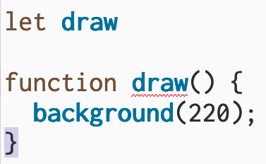
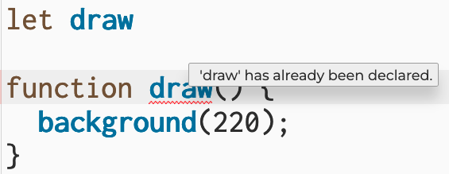
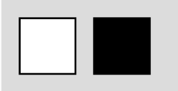
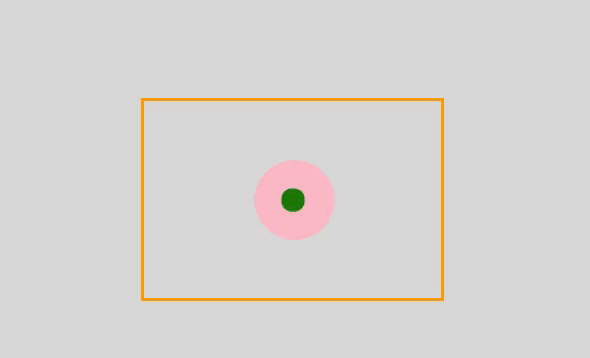

# Week 02: 9/3/25


*Source: [Casey Reas, 2010](https://reas.com/p18_s2/)*

---

## Agenda

1. Homework Review
2. Introductions
3. Intro to Coding
4. Break
5. Tutorial: Drawing with p5.js
6. In-Class Practice
7. Assignment

---

## Homework Review

In groups of 3:
* Introduce yourselves
* Share your work & documentation. If there were any parts where you struggled, share those questions and see if your group can find an answer. 
* Chat about any thoughts on the short reading.
* Work together to answer to the following review questions: 
    1. What function is called every frame? Which function is called only once?
    2. What is a parameter?
    3. Write down an example of a p5 function with more than one parameter. 
* 10-15 minutes. We will come together as a class to discuss.

---

## Variables and Movement

### Coding Glossary
| Generic Definitions | |
|---|---|
| expression | a unit of code that resolves to a value, eg. `1 + 3`|
| operator | syntax for expression, eg. in the above expression the operator is `+` |
| variable | name for placeholder piece of data |
| declaration | uses the keyword `let`, gives a variable a value |
| assignment | gives a value to a variable name using `=`|

#### Operators
There are many different types of operators, which you can read up [the full list](https://developer.mozilla.org/en-US/docs/Web/JavaScript/Guide/Expressions_and_operators). 

The two most important types of operators (for now):
1. assignment, ie `=`
2. arithmetic, ie `+`, `-` (math)

#### Variables and Declaration

In order to "assign" or "make this word equal to a piece of data", we `declare` a variable. `let` is the keyword we use here to tell the code, "hey, the next word is going to represent some value".
```js
let myVariable
```
##### `let` vs `var` vs `const`
We basically always will use `let` because it is the modern way of coding (circa 2016). You shouldn't really be using `const` or `var`, and these are usually flags for getting code from elsewhere. 

#### Assignment Operator
Assignment happens when we give that named variable a value using the `=`.
```js
let teacher = "sam"
```

#### Variable Types
JavaScript isn't specific about different variable types, but we do know when p5 accepts variables as parameters in functions it will be either a "Number" or "String". 

* `Number` is like 1,2,3,4,5
* `String` is a word, but wrapped in `""`

#### Variable Names
When creating variable names, we can pretty much use whatever we want, but being specific helps us and readers of our code to understand what is happening. 

There is one restriction: you cannot use words that already exist in p5. These are called `reserved words` and will often throw an error. 
You might have seen red squiggly lines under some of your code, this means something is wrong. 
  
If we hover over the word, it will give us some information.   
  
`'draw' has already been declared` means that we are either using the same variable name twice, or that we are infringing on a reserved word. 

Typical naming convention in JavaScript is to use `camel case`, which just means the first letter of the first word is lowercase, and every word after that has uppercase. There should be no spaces in variable names. 
```js
let mySuperCoolVariableThatUsesCamelCase = 'nice'
```

### Tutorial: Animation

Everything following this tutorial is specific to p5, but doesn't necessarily require the glossary. But just so you know, everything mentioned in the tutorial is not generic. 

We can animate in p5 using math and applying it to variables. 
  
The ball is moving at a rate of 20 pixels to the *right* ***every frame***. Every frame means the `draw`. So we can calculate that the position is moving `+20` on the x-axis. 
This position needs to change over time! 
| frame number | x position|
|---|---|
| 1 | 20 |
| 2 | 40 |
| 3 | 60 |

But how can we make a number that with every frame needs to increase by 20?  
By using a variable and a combination of arithmatic and assignment operators. 

1) We need to create a variable to store the first frame position. 
```js
let x = 20
```
This will represent the location of the circle for the first frame. 
```js
circle(x, 20, 30)
```
2) In order to increment `x`, we need to increase the number...
```js
x + 20
```
...but we also need to assign it to that new number. We are overriding the previous value of x with this new updated value.
```js
x = x + 20
```
3) Any movement needs to happen in the `draw()`, because that is the animation loop. 
```js
let x = 20

function draw(){
    background(225)
    circle(x, 20, 30)
    x = x + 30
}
```
The reason the declaration of the variable x (ie `let x = 20`) happens before the loop is because it will override any changes that happen inside the loop and motion wouldn't happen. So we need the variable to be `global`, or outside of both the `setup()` and the `draw()`. This gets into scope.

### Scope

Scope is where code can "see" variables. It is defined within different `{}`. So the `setup()` has a scope that is different from the `draw()`. Global means that variables exist inside the entire file and are not limited by the `{}`.

### Randomness
[`random()` p5 reference](https://p5js.org/reference/p5/random/)
We can incorporate randomness into our sketches by using `random()`. For now, randomness can take 2 parameters
```js
random([min], [max])
```
These are numbers, with inclusive minimum and exclusive maximum. If you don't pass in a number it will generate a long decimal between 0 and 1. 

Usually with randomness we want round numbers, so we can use `floor()` to round the number down.
```js
let randNumber = random()
randNumber = floor(randNumber)
```
This is similar to overriding a value of a mathematical equation. 

### `push()` and `pop()`

A way to create layers so that our style choices for each shape don't impact others is to wrap our code inside of `push()` and `pop()` functions. 

```js
fill('black')

push()
fill('white') // because white is inside the push and pop, it doesn't impact any shapes outside of them
rect(10, 10, 30, 30) // left rectangle
pop()

rect(50, 10, 30, 30) // right rectangle
```
Will give us:  


## Demos
* [basic movement and variables](https://editor.p5js.org/samheckle/sketches/DGgJtcBGW)
* [random](https://editor.p5js.org/samheckle/sketches/hXk-Oksl0P)
* [push and pop](https://editor.p5js.org/samheckle/sketches/c9mWUA4NO)

## Misc Resources
* [color palette generator](https://coolors.co/)
* [`sin()`](https://p5js.org/reference/p5/sin/)
* [`frameRate`](https://p5js.org/reference/p5/frameRate/)

## Assignment
Due Class 3:

Do:

* [ ] Finish in-class practice #2  
  
This is what your submitted sketch should look like.  
* [ ] Start thinking about exercise #2 (due Class 4)  

Read & Respond:
* [ ] Reading #1
