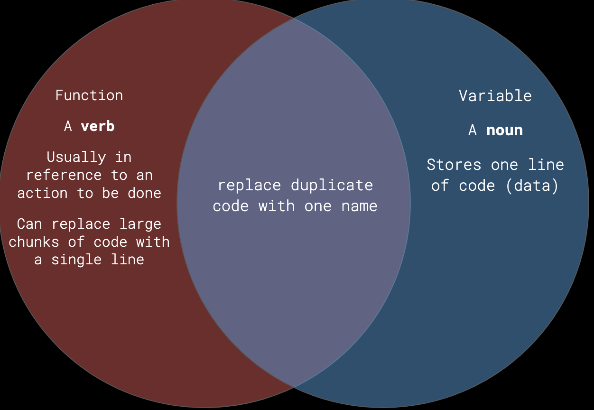

# Week 04: 9/17/25

## Agenda

1. Attendance 
2. Homework Share
3. Lecture: Repetition and Functions
4. In-class: Functions

## Homework Share

## Functions

### Coding Glossary: Review
<table>
<tbody>
<tr><td>function</td><td>

an instruction or command, may or may not have parameters. also known as `method`

</td></tr>
<tr><td>parameters</td><td>

values that are passed into the function inside the `()`. also known as `arguments`.

</td></tr>

<tr><td>declaration</td><td>

using the keyword `let`, names and creates a variable

</td></tr>
</tbody>
</table>

Declarations can also be used for functions, using the keyword `function`

Functions need to be written ***outside*** the `setup()` and the `draw()`

We have already seen an example of this:
```js
function setup(){
    createCanvas(400,400)
}
function draw(){

}
```

`setup()` and `draw()` are functions that use the function keyword. We have also seen:

```js
function mousePressed(){
    // do something when the mouse is clicked
}
```

### Custom Functions

So far, we have used functions that have only been defined by p5. Even though we are declaring and using `setup()`, `draw()`, and `mousePressed()`, they aren't something we are specifically defining. So, we can [create our own functions](https://p5js.org/reference/p5/function/) too. These still need to be written ***after*** the `draw()`

```js
function myCoolNewFunction(){

}
```

We can also make custom parameters:
```js
function myCoolNewFunction(myCoolParameter){
    print(myCoolParameter)
}
```

#### Coding Glossary: Custom Functions

<table>
<tbody>
<tr><td>declaration</td><td>

using the keyword `function`, names and creates a function

</td></tr>
<tr><td>call</td><td>

to use a function elsewhere in the code

</td></tr>
<tr><td>passing arguments</td><td>

a custom function accepting inputs in their headers, which creates a local placeholder for the data that is received

</td></tr>
</tbody>
</table>

#### Why make custom functions?

1. Code can be duplicated more easily.
2. It makes our code more readable and organized, just like variables. 
    * if you notice you are doing the same section of code multiple times, it can probably be a function!



## Demos
* [Functions 1](https://editor.p5js.org/samheckle/sketches/FdE_a2BK9)
    * functions require 2 parts: the declaration using the `function` keyword and the `call`. We `call` a function when we use the function elsewhere in the code, just like we reference a variable after assigning it.
    * functions can use custom parameters, defined in the `()` when declaring it. the custom parameters only exist inside the `{}`.
* [Functions 2](https://editor.p5js.org/samheckle/sketches/1DKJfDQYr)
    * functions are typically used to organize chunks of code, usually to do a specific action
    * we also looked at text attributes: `textSize()`, `textWrap()`, and creating a bounding box with the last two optional parameters in `text(string, x, y, boundingX, boundingY)`. this allows us to limit where the text is, like creating the width and height of a `rect()`.