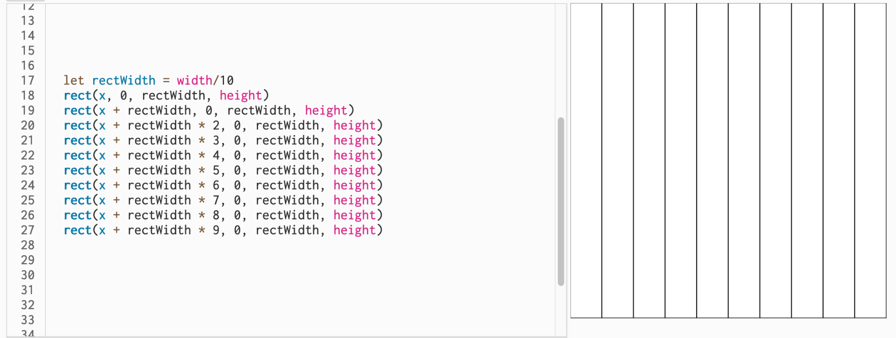
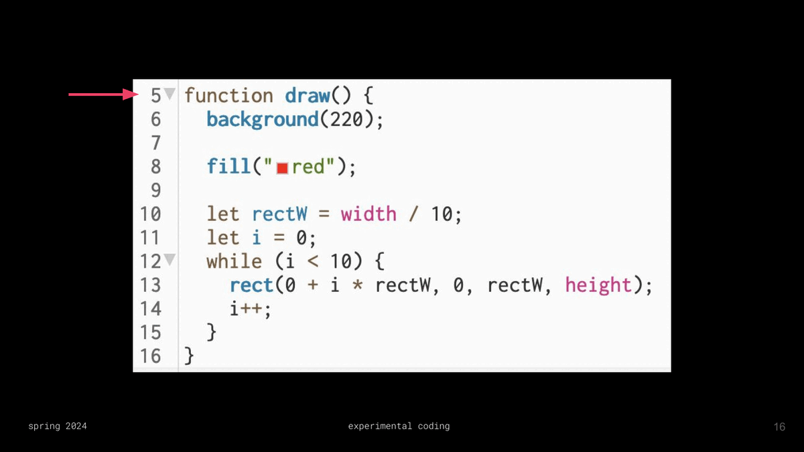

# Week 04: 9/17/25

## Agenda

1. Attendance 
2. Homework Share
3. Lecture: Repetition and Functions
4. In-class: Functions
5. Lecture: Repetition and Loops
6. In-class: While Loop
7.  In-class: For Loop

## Homework Share

## Functions

### Coding Glossary: Review
<table>
<tbody>
<tr><td>function</td><td>

an instruction or command, may or may not have parameters. also known as `method`

</td></tr>
<tr><td>parameters</td><td>

values that are passed into the function inside the `()`. also known as `arguments`.

</td></tr>

<tr><td>declaration</td><td>

using the keyword `let`, names and creates a variable

</td></tr>
</tbody>
</table>

Declarations can also be used for functions, using the keyword `function`

Functions need to be written ***outside*** the `setup()` and the `draw()`

We have already seen an example of this:
```js
function setup(){
    createCanvas(400,400)
}
function draw(){

}
```

`setup()` and `draw()` are functions that use the function keyword. We have also seen:

```js
function mousePressed(){
    // do something when the mouse is clicked
}
```

### Custom Functions

So far, we have used functions that have only been defined by p5. Even though we are declaring and using `setup()`, `draw()`, and `mousePressed()`, they aren't something we are specifically defining. So, we can [create our own functions](https://p5js.org/reference/p5/function/) too. These still need to be written ***after*** the `draw()`

```js
function myCoolNewFunction(){

}
```

We can also make custom parameters:
```js
function myCoolNewFunction(myCoolParameter){
    print(myCoolParameter)
}
```

#### Coding Glossary: Custom Functions

<table>
<tbody>
<tr><td>declaration</td><td>

using the keyword `function`, names and creates a function

</td></tr>
<tr><td>call</td><td>

to use a function elsewhere in the code

</td></tr>
<tr><td>passing arguments</td><td>

a custom function accepting inputs in their headers, which creates a local placeholder for the data that is received

</td></tr>
</tbody>
</table>

#### Why make custom functions?

1. Code can be duplicated more easily.
2. It makes our code more readable and organized, just like variables. 
    * if you notice you are doing the same section of code multiple times, it can probably be a function!


## Repetition & Loops

### Review

1. Create a new sketch titled "In-class 4b"
2. Create 20 columns that turn red only when you hover over the column using if-statements.
    * The columns should not have a fill until they are hovered. They can either have noFill() or a fill('white') until they are hovered over.
3. Skip over column #7 (it should not fill the 7th column).

### Identifying Patterns



We can rewrite this as 

```js
let rectWidth = width/10
rect(x + rectWidth * 0, 0, rectWidth, height)
rect(x + rectWidth * 1, 0, rectWidth, height)
rect(x + rectWidth * 2, 0, rectWidth, height)
rect(x + rectWidth * 3, 0, rectWidth, height)
rect(x + rectWidth * 4, 0, rectWidth, height)
rect(x + rectWidth * 5, 0, rectWidth, height)
rect(x + rectWidth * 6, 0, rectWidth, height)
rect(x + rectWidth * 7, 0, rectWidth, height)
rect(x + rectWidth * 8, 0, rectWidth, height)
rect(x + rectWidth * 9, 0, rectWidth, height)
```

#### Coding Glossary: Loops

<table>
<tbody>
<tr><td>loop</td><td>

code that repeats the content inside `{}`. the `draw()` is a loop that already exists for us.

</td></tr>
</tbody>
</table>

### While Loop

A `while()` loop is very similar to an `if()` statement. They follow similar syntax that use `()` and `{}`.

When we build out an `if()` statement, we put the conditional expression inside the `()` and the code that is locked in the `{}`. A `while()` loop is the same.

```js
while(conditional expression){
    // loop something
}
```

But, there are some extra steps in order to get the loop functional.

<h1> 

It is super important at this point to make sure you do not have `Auto Refresh` checked in your p5 editor.
 </h1>

1. The first thing we want is to declare a number that will control the loop and determine *when the loop stops*. This is just a normal variable.
```js
let iterator = 0
```
2. Next, we determine how many times our loop wants to execute using our new variable and a conditional expression. Once this conditional becomes `false`, the loop stops.
```js
iterator < 10
```
This means our loop will iterate 9 times, starting at 0. This conditional is what goes inside the `()` of our `while()`
```js
while(iterator < 10){

}
```
3. We need to change our variable inside our loop, meaning inside the `{}`. This is just like a variable changing in the draw, where it increments once it hits the bottom (or wherever the variable is located).
```js
while(iterator < 10){
    iterator += 1
}
```
Our final code for our loop will look something like:


### For Loop

A `for()` loop is a shorthand way of writing a `while()` loop. Instead of having 3 separate lines of code (declaring iterator, writing conditional, incrementing iterator), we do it all inside the `()` of the `for()`, all separated by a `;`.

To write 
```js
let iterator = 0;
while(iterator < 10){
    iterator += 1
}
```
As a `for()` loop, we combine all these lines into one.
```js
for(let iterator = 0; iterator < 10; iterator +=1){
    // do something 10 times
}
```